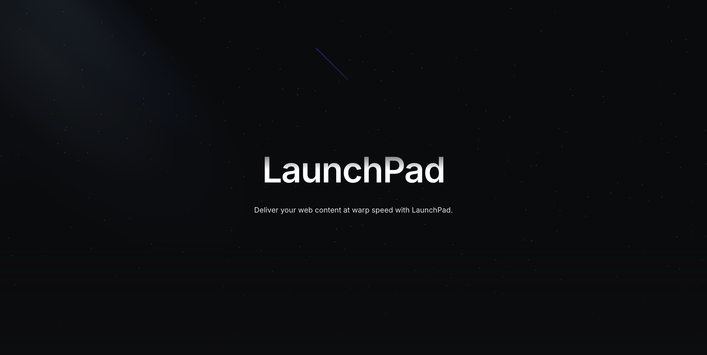

# 🚀 LaunchPad - Official Strapi Demo (Refactored)



Welcome to **LaunchPad**, the official Strapi demo application. This project is a full-stack starter kit combining **Strapi 5** (CMS) and **Next.js** (Frontend) with a pre-configured **PostgreSQL** database.

---

### 🛡️ Optimized for Production
Do not build your images directly on a low-RAM VPS! We highly recommend using the [Private Docker Registry Boilerplate](https://github.com/tuquet/docker-registry-boilerplate) to store your pre-built images. This ensures a **lightweight, fast, and secure** deployment cycle.

---

## 🛠️ Environment Matrix

To avoid port conflicts on local machines, we use different port ranges for Docker and Local development.

| Service | Local Dev (Non-Docker) | Docker (Production-ready) |
| :--- | :--- | :--- |
| **Strapi Backend** | [http://localhost:1338](http://localhost:1338) | [http://localhost:1337](http://localhost:1337) |
| **Next.js Frontend** | [http://localhost:3002](http://localhost:3002) | [http://localhost:3000](http://localhost:3000) |
| **PostgreSQL** | `localhost:5430` | `localhost:5432` (Internal) |
| **Adminer (DB UI)** | [http://localhost:8080](http://localhost:8080) | [http://localhost:8080](http://localhost:8080) |
| **Swagger Docs** | [/documentation/v1.0.0](/documentation/v1.0.0) | [/documentation/v1.0.0](/documentation/v1.0.0) |

---

## 🏗️ 1. Local Development (Hybrid Mode)
*Best for speed, hot-reloading, and avoiding Windows/Docker permission issues.*

### Step 1: Start the Database
Ensure only the Database and DB UI are running in Docker:
```powershell
docker-compose up -d strapiDB adminer
```

### Step 2: Setup Environments
Install dependencies and sync `.env` files across root, `strapi/`, and `next/`:
```powershell
yarn setup
```
> **Tip:** The `yarn setup` script automatically generates unique secrets for `tobemodified` keys in your `.env` files.

### Step 3: Run the Engines
Start both Strapi and Next.js concurrently:
```powershell
yarn dev
```
- **Strapi** will be available at `1338`.
- **Next.js** will be available at `3002`.

---

## 🐳 2. Docker Full-Stack Deployment
*Best for production simulation or consistent environments.*

### Spin up everything
```powershell
docker-compose up -d --build
```

### 🔄 Updating Changes to Docker
If you modify Code or Environment Variables, follow this workflow to ensure Docker is synced:
1. **Down**: `docker-compose down`
2. **Build**: `docker-compose build nextjs strapi` (Bypass cache to bake in new Env vars with --no-cache args)
3. **Up**: `docker-compose up -d`

### 🧪 Troubleshooting "Failed to fetch module"
If the Strapi Admin UI shows blank/broken pages, it's likely a hydration issue. Run a clean rebuild:
```powershell
docker-compose down -v
docker-compose build --no-cache
docker-compose up -d
```

---

## 💾 3. Data Management

### Seeding (Import Demo Data)
To populate your instance with the provided demo content:
```powershell
# If running Local Dev
cd strapi && yarn seed

# If running in Docker (Windows users MUST use -u root)
docker exec -it -u root strapi yarn seed
```

### Database Access
- **Adminer**: [http://localhost:8080](http://localhost:8080)
- **Server**: `strapiDB`
- **Username/Password**: See your `.env` file (`strapi` / `strapi_secure_password_123`)

---

## 📝 Best Practices & Knowledge base

- **Image URL Logic**: We use `NEXT_PUBLIC_STRAPI_URL` to ensure the browser loads images from the correct endpoint, bypassing Docker's internal networking issues.
- **Port Conflicts**: Port `3000`/`1337` are reserved for Docker. Port `3002`/`1338` are for Local Dev. 
- **Git Hygiene**: 
    - Don't commit `.env` files.
    - `src/extensions/documentation` files can be committed if you want to track API changes, or ignored if you want Strapi to auto-generate them.

---

## Features Overview ✨

- **Next.js 15+ & Strapi 5**: Cutting edge tech stack.
- **Dynamic Zones**: Build complex pages with reusable blocks.
- **SEO Optimized**: Pre-configured SEO component and metadata handling.
- **Multi-lingual**: Full i18n support.

---

## Resources
- [Strapi Documentation](https://docs.strapi.io)
- [Next.js Documentation](https://nextjs.org/docs)


[Docs](https://docs.strapi.io) • [Discord](https://discord.strapi.io) • [YouTube](https://www.youtube.com/c/Strapi/featured) • [Strapi Design System](https://design-system.strapi.io/) • [Marketplace](https://market.strapi.io/) • [Cloud Free Trial](https://cloud.strapi.io)

---

## 🌌 The LaunchPad Ecosystem

This project is part of the **LaunchPad** ecosystem—a complete suite of boilerplates designed for high-performance, production-ready development. Check out the other repositories to complete your stack:

- 📱 [**LaunchPad Mobile Native**](https://github.com/tuquet/launchpad-mobile-native): A React Native/Expo mobile app boilerplate configured for seamless Strapi integration.
- 💻 [**LaunchPad CMS Fullstack**](https://github.com/tuquet/launchpad-cms-fullstack): A full-stack starter kit combining Next.js (Frontend) and Strapi 5 (Headless CMS) with Docker support.
- 🐳 [**LaunchPad Registry Stack**](https://github.com/tuquet/launchpad-registry-stack): A lightweight, self-hosted private Docker Registry with Web UI to streamline your CI/CD and save VPS resources.

⭐️ **If you find this ecosystem useful, please consider giving the repositories a star on GitHub!**

---

## Customization

- The Strapi application contains a custom population middlewares in every api route.

- The Strapi application contains a postinstall script that will regenerate an uuid for the project in order to get some anonymous usage information concerning this demo. You can disable it by removing the uuid inside the `./strapi/packages.json` file.

- The Strapi application contains a patch for the @strapi/admin package. It is only necessary for the hosted demos since we automatically create the Super Admin users for them when they request this demo on our website.
